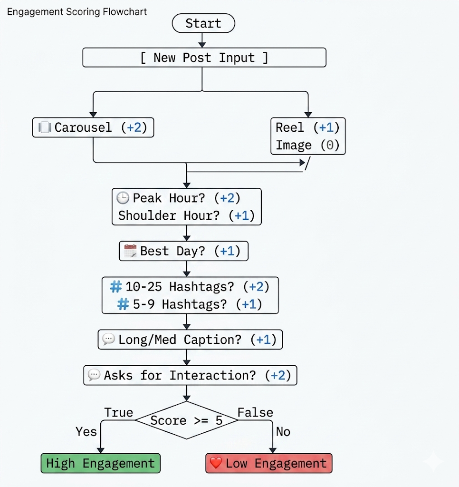

## Instagram Engagement Classifier

Following is a rule-based AI classifier, designed as a qualififying project for my club recruitment, that predicts whether an Instagram post will get High or Low engagement. Built as part of an AIML coursework assignment, it uses a scoring system based on real-world patterns.

## 1. Dataset
The dataset for this project is provided in the repository as dataset.csv. It contains 25 labeled Instagram posts with 7 features (content type, posting hour, hashtags, caption length, interaction request, day of week, and engagement label).

## 2. Code & Structure
The main logic is implemented in Python. There are two interfaces provided:
- Command-Line Tool (classifier.py): An automated script that tests rules against the dataset and compares results with a machine learning model.
- Interactive GUI (app.py): A visual dashboard to add posts, load CSVs, and analyze trends.

### Explanation of Logic
The classifier uses a rule-based weighted scoring system based on digital marketing heuristics. A post starts with 0 points. Each feature is evaluated, and points are awarded if the feature aligns with high-engagement best practices. If the total score is 5 or greater (out of a maximum of 10), the post is classified as "High Engagement". Otherwise, it is classified as "Low Engagement".

### Pseudocode

function classify_engagement(post_features):
    score = 0
    if content_type is carousel: score += 2
    else if content_type is reel: score += 1
    if posting_hour is 8-10 or 19-21: score += 2
    else if posting_hour is 11-18: score += 1
    if day_of_week is Tuesday, Wednesday, or Thursday: score += 1
    if hashtags between 10 and 25: score += 2
    else if hashtags between 5 and 9: score += 1
    if caption_length is medium or long: score += 1
    if asks_for_interaction is true: score += 2
    if score >= 5: return "High Engagement"
    else: return "Low Engagement"

### Flowchart

## 3. Instructions to Run

### Install Dependencies
Ensure you have Python installed, then install the required libraries:

### Option A: Run the GUI Dashboard (Recommended)
This launches a visual interface to interact with the classifier.

### Option B: Run the CLI Classifier
This applies the scoring rules, and generates performance metrics in the terminal.

### Option C: Run with ML Comparison
This mode trains a scikit-learn Decision Tree on the dataset to validate that the hand-crafted rule weights align with machine learning feature importances.
aiml project